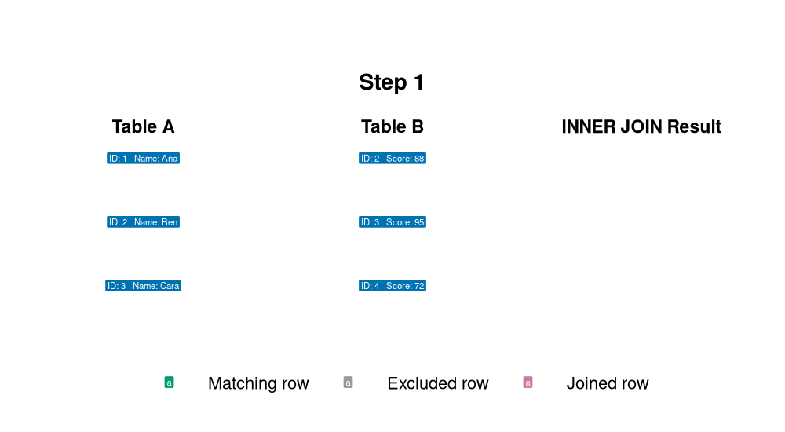
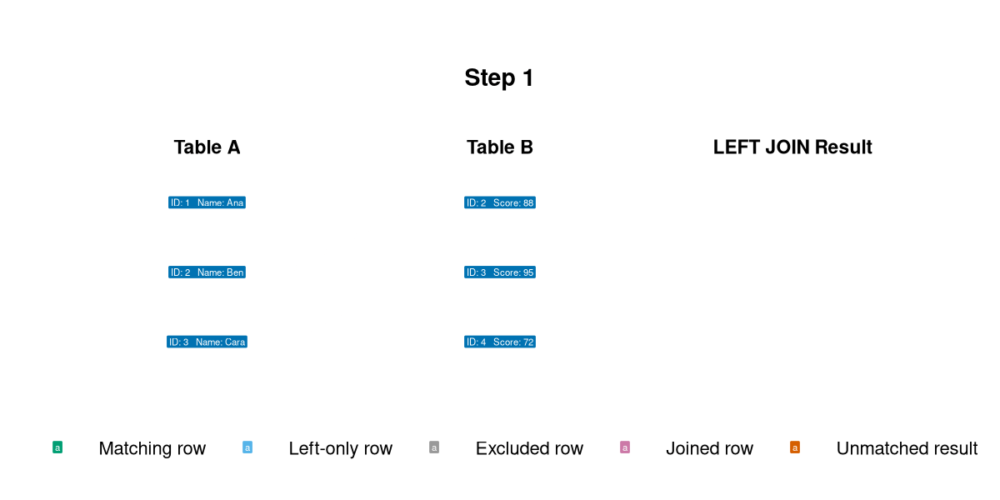
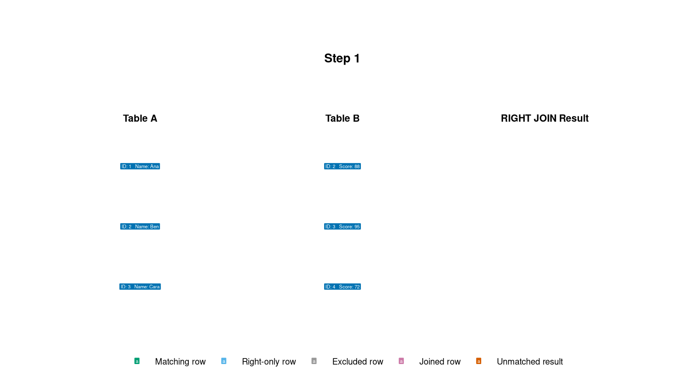
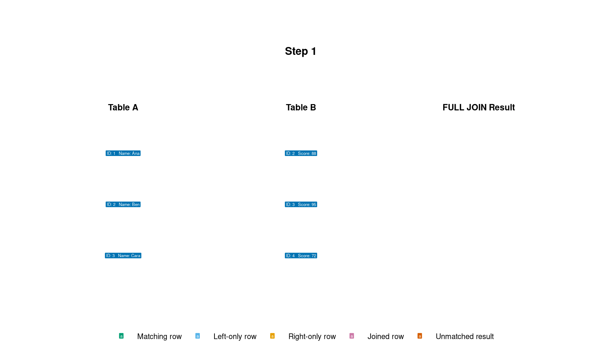

## Agenda

1. **Relational Joins**
   - Inner, Left, Right, Full, Cross, and Self Joins
2. **Subqueries**
   - Scalar, Multi-row, and Correlated
3. **Database Views**
   - Virtual tables and Materialized Views


::: notes
Today we will cover three tools for organizing relational queries: joins, subqueries, and views.
:::

# Joins

## The Concept of Joins

To combine data from two or more tables, we use a common column (usually a Foreign Key).

```{mermaid}
graph LR
    A[Table A] --- B{Join Condition}
    C[Table B] --- B
    B --> D[Combined Result Set]

    classDef table fill:#0072B2,stroke:#333,stroke-width:2px,color:#fff
    classDef logic fill:#E69F00,stroke:#333,stroke-width:2px,color:#000
    classDef result fill:#009E73,stroke:#333,stroke-width:2px,color:#fff

    class A,C table
    class B logic
    class D result
```


::: notes
Joins are the heart of relational databases. We look for a "bridge" between tables to pull related information together in a single result set.
:::

## Inner Join





## Inner Join


Returns records that have matching values in both tables.

```sql
SELECT 
    employees.name, 
    departments.dept_name
FROM employees
INNER JOIN departments 
ON employees.dept_id = departments.id;
```

*   Only matches are returned.
*   If an employee has no department, they are excluded.
*   If a department has no employees, it is excluded.

::: notes
The Inner Join is the most common join. Think of it as the "intersection" of two sets. If there is no overlap, you get nothing.
:::

## Left Join



## Left Join 

Returns all records from the left table, and the matched records from the right table.

```sql
SELECT 
    employees.name, 
    departments.dept_name
FROM employees
LEFT JOIN departments 
ON employees.dept_id = departments.id;
```

*   If there is no match, the result is `NULL` on the right side.
*   Useful for finding "missing" relationships.

::: notes
The Left Join is crucial when you want to keep your primary list intact, regardless of whether the second table has matching data.
:::

## Right Join



## Right Join

Returns all records from the right table, and the matched records from the left table.

```sql
SELECT 
    employees.name, 
    departments.dept_name
FROM employees
RIGHT JOIN departments 
ON employees.dept_id = departments.id;
```

*   The opposite of a Left Join.
*   Includes all departments, even those without employees.
*   Requires SQLite 3.39.0 or later.

::: notes
While Right Join exists, many developers prefer using Left Join and simply switching the order of the tables to keep their logic reading from left to right.
:::

## Full Join




## Full Join

Returns all records when there is a match in either the left or right table.

```sql
SELECT 
    employees.name, 
    departments.dept_name
FROM employees
FULL OUTER JOIN departments 
ON employees.dept_id = departments.id;
```

*   Combines the effect of Left and Right joins.
*   Provides a complete picture of all data in both tables.
*   Requires SQLite 3.39.0 or later.

::: notes
Full Outer Join is used when you want to see everything from both sides, showing where matches exist and where they don't.
:::

## Self Join

A join where a table is joined with itself.

```sql
SELECT 
    e1.name AS Employee, 
    e2.name AS Manager
FROM employees e1
INNER JOIN employees e2 
ON e1.manager_id = e2.id;
```

*   Requires table aliasing (`e1`, `e2`).
*   Used for hierarchical data (e.g., Employee -&gt; Manager).

::: notes
Self joins are essential for organizational charts or any data structure where a row has a relationship with another row in the same table.
:::

## Activity: Joins

Use the Chinook database. Write one query for each task.

1. **Album catalog:** Join `Artist` and `Album`. Return the artist name as `ArtistName` and album title as `AlbumTitle`. Sort by artist and album title.
2. **Long tracks:** Join `Track` and `Genre`. Return `TrackName`, `GenreName`, and `Milliseconds` for tracks longer than 300,000 milliseconds. Show the longest tracks first.
3. **Customer invoice coverage:** Use a left join between `Customer` and `Invoice`. Return each customer's ID, first name, last name, and invoice count. Keep customers who have no invoices.

::: notes
Allow students about 15 minutes. Encourage them to identify the matching key columns before they write each query. Solutions appear at the end of the deck.
:::


# Subqueries

## Subqueries

A subquery is a query nested inside another query.

```{mermaid}
graph TD
    Outer[Outer Query / Main Query] -->|Contains| Inner[Inner Query / Subquery]
    Inner -->|Returns Data| Outer

    classDef outer fill:#0072B2,stroke:#333,color:#fff
    classDef inner fill:#E69F00,stroke:#333,color:#000

    class Outer outer
    class Inner inner
```


::: notes
Subqueries allow for complex, multi-step data retrieval in a single statement. They can be used in SELECT, FROM, WHERE, and HAVING clauses.
:::

## Scalar Subqueries

A subquery that returns exactly **one** value (one row, one column).

```sql
SELECT name, salary
FROM employees
WHERE salary > (SELECT AVG(salary) FROM employees);
```

*   Returns a single value for comparison.
*   Often used in `SELECT` or `WHERE`.

::: notes
Scalar subqueries are very efficient for comparing individual rows against an aggregate value, like finding people paid more than the average.
:::

## Multi-row Subqueries

Subqueries that return a list of values (one column, multiple rows).

```sql
SELECT name
FROM employees
WHERE dept_id IN 
  (SELECT id FROM departments WHERE location = 'New York');
```

*   Common operators include `IN`, `ANY`, `ALL`, and `EXISTS`.
*   Used to filter against a dynamic list.
*   SQLite supports `IN` and `EXISTS`, but not the SQL-standard `ANY` and `ALL` operators directly.

::: notes
Multi-row subqueries are powerful for filtering one table based on a set of criteria found in another table without using a traditional JOIN.
:::

## Activity: Subqueries

Use the Chinook database. Write one query for each task.

1. **Longer than average:** Return the name and length in milliseconds of every track that is longer than the average track length. Use a scalar subquery.
2. **Rock and Metal tracks:** Return the track name and unit price for tracks whose genre is either `Rock` or `Metal`. Use a multi-row subquery with `IN`.


::: notes
Allow students about 12 minutes. Ask them to run each inner query by itself before placing it inside the outer query.
:::


# Views

## Views: Definition

A View is a "virtual table" based on the result-set of an SQL statement.

*   It does not store data itself (unless it is a Materialized View).
*   It is a stored query.
*   It acts as a window into your real tables.

::: .notes
Views are not actual tables. They are saved queries that look and behave like tables.
:::

## Why use Views?

1. **Security:** Hide sensitive columns (like salaries or SSNs) by creating a view that only shows non-sensitive info.
2. **Simplicity:** Simplify complex joins into a single "virtual" table.
3. **Consistency:** Standardize how specific logic (like "Active Customers") is calculated across the organization.

::: notes
Instead of writing a 50-line JOIN query every time, you can write it once, save it as a view, and then just `SELECT * FROM my_view`.
:::

## Creating and Using Views

```sql
-- Creating a view
CREATE VIEW active_employee_contact AS
SELECT name, email, phone
FROM employees
WHERE status = 'Active';

-- Using the view
SELECT * FROM active_employee_contact;
```

*   You can use `SELECT`, `JOIN`, and `WHERE` on a view just like a table.

::: notes
Once the view is created, it becomes part of your database schema for all users with permission to access it.
:::

## Materialized Views

Unlike standard views, **Materialized Views** actually store the data physically.

*   **Pros:** Extremely fast for heavy calculations or large aggregations.
*   **Cons:** The data can become "stale" (outdated) and must be refreshed.
*   **SQLite note:** SQLite does not provide native materialized views.

```sql
-- Refreshing a materialized view (syntax varies by DB)
REFRESH MATERIALIZED VIEW sales_summary;
```

::: notes
Use Materialized Views for reporting/dashboards where the data doesn't need to be second-by-second real-time, but speed is critical.
:::

## Activity: Views

Use the Chinook database to build and query a reusable customer summary.

1. Create a view named `customer_invoice_summary` that returns each customer's ID, first name, last name, and country. Include the number of invoices as `InvoiceCount` and the total amount spent as `TotalSpent`.
2. Query the view to show the 10 customers with the highest `TotalSpent`.


::: notes
Allow students about 12 minutes. Remind them that a standard view stores the query rather than a separate copy of its results.
:::

# Glossary

## Glossary: Query Commands

| Command | Purpose |
|---|---|
| `SELECT` | Chooses the columns or calculated values to return. |
| `FROM` | Identifies the source table, view, or subquery. |
| `WHERE` | Filters individual rows before grouping. |
| `GROUP BY` | Combines rows that share the same values for aggregate calculations. |
| `HAVING` | Filters groups after `GROUP BY`. |
| `ORDER BY` | Sorts the result in ascending or descending order. |
| `LIMIT` | Restricts the number of rows returned. |
| `AS` | Assigns a temporary alias to a column, table, or calculated value. |

## Glossary: Joins

| Command or term | Purpose |
|---|---|
| `JOIN` / `INNER JOIN` | Returns rows with matching values in both tables. |
| `LEFT JOIN` | Returns every row from the left table and matching rows from the right table. |
| `RIGHT JOIN` | Returns every row from the right table and matching rows from the left table. |
| `FULL OUTER JOIN` | Returns matched rows plus unmatched rows from both tables. |
| `CROSS JOIN` | Returns every possible pairing of rows from two tables. |
| `ON` | States the condition used to match rows. |
| Self join | Joins a table to itself by using separate table aliases. |
| `NULL` | Represents a missing or unknown value, including an unmatched outer-join value. |

## Glossary: Subqueries and Views

| Command or term | Purpose |
|---|---|
| Subquery | Places one query inside another query. |
| `AVG()` | Calculates an arithmetic mean and can supply a scalar subquery value. |
| `COUNT()` | Counts rows or non-null values. |
| `SUM()` | Adds numeric values. |
| `ROUND()` | Rounds a numeric value to a specified number of decimal places. |
| `IN` | Tests whether a value occurs in a list returned by a subquery. |
| `EXISTS` | Tests whether a subquery returns at least one row. |
| `ANY` / `ALL` | Compare a value with some or every value from a subquery. SQLite does not support these operators directly. |
| `CREATE VIEW` | Saves a query as a virtual table. |
| `DROP VIEW` | Removes a view definition. |
| `REFRESH MATERIALIZED VIEW` | Updates stored materialized-view results in systems that support the command. SQLite does not. |

# Activity Solutions

## Joins Activity: Solution 1

```sql
SELECT
    ar.Name AS ArtistName,
    al.Title AS AlbumTitle
FROM Artist AS ar
INNER JOIN Album AS al
    ON ar.ArtistId = al.ArtistId
ORDER BY ar.Name, al.Title;
```

## Joins Activity: Solution 2

```sql
SELECT
    t.Name AS TrackName,
    g.Name AS GenreName,
    t.Milliseconds
FROM Track AS t
INNER JOIN Genre AS g
    ON t.GenreId = g.GenreId
WHERE t.Milliseconds > 300000
ORDER BY t.Milliseconds DESC;
```

## Joins Activity: Solution 3

```sql
SELECT
    c.CustomerId,
    c.FirstName,
    c.LastName,
    COUNT(i.InvoiceId) AS InvoiceCount
FROM Customer AS c
LEFT JOIN Invoice AS i
    ON c.CustomerId = i.CustomerId
GROUP BY c.CustomerId, c.FirstName, c.LastName
ORDER BY InvoiceCount, c.LastName, c.FirstName;
```


## Subqueries Activity: Solution 1

```sql
SELECT Name, Milliseconds
FROM Track
WHERE Milliseconds > (
    SELECT AVG(Milliseconds)
    FROM Track
)
ORDER BY Milliseconds DESC;
```

## Subqueries Activity: Solution 2

```sql
SELECT Name, UnitPrice
FROM Track
WHERE GenreId IN (
    SELECT GenreId
    FROM Genre
    WHERE Name IN ('Rock', 'Metal')
)
ORDER BY Name;
```

## Views Activity: Solution 1

```sql
CREATE VIEW customer_invoice_summary AS
SELECT
    c.CustomerId,
    c.FirstName,
    c.LastName,
    c.Country,
    COUNT(i.InvoiceId) AS InvoiceCount,
    ROUND(SUM(i.Total), 2) AS TotalSpent
FROM Customer AS c
INNER JOIN Invoice AS i
    ON c.CustomerId = i.CustomerId
GROUP BY
    c.CustomerId,
    c.FirstName,
    c.LastName,
    c.Country;
```

## Views Activity: Solutions 2 and 3

```sql
-- Ten customers with the highest total spending
SELECT *
FROM customer_invoice_summary
ORDER BY TotalSpent DESC
LIMIT 10;

-- USA customers who spent more than $40
SELECT *
FROM customer_invoice_summary
WHERE Country = 'USA'
  AND TotalSpent > 40
ORDER BY TotalSpent DESC;
```
